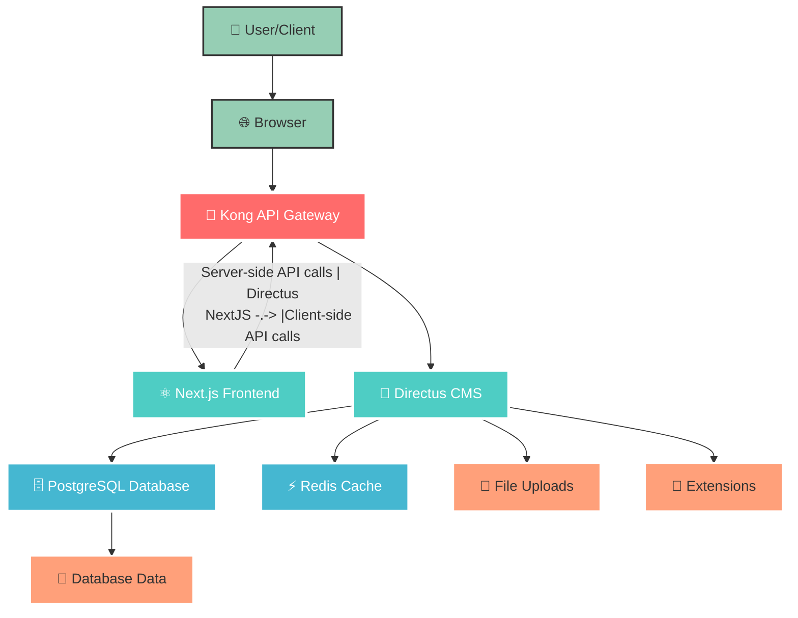

# HarmonyX CMS v6

Welcome to **HarmonyX CMS v6**! A modern, scalable CMS solution built with **Next.js 15** frontend and **Directus 11** headless CMS, orchestrated through **Kong API Gateway** for production-ready microservices architecture.

## 🏗️ Architecture Overview



## 🚀 Technology Stack

| Component | Technology | Version | Purpose |
|-----------|------------|---------|---------|
| **API Gateway** | Kong | 3.7 | Request routing, CORS, SSL |
| **Frontend** | Next.js | 15.2.4 | SSR/SSG React framework |
| **CMS** | Directus | 11.7.2 | Headless CMS + Admin |
| **Database** | PostgreSQL + PostGIS | 16 | Primary data storage |
| **Cache** | Redis | 6 | Session & content caching |
| **Container** | Docker Compose | - | Service orchestration |

## 📁 Project Structure

```
harmonyx-cms-v6/
├── 🐳 docker-compose.yaml    # Service orchestration
├── 🌍 .env                   # Environment variables
├── ⚛️ nextjs/               # Next.js frontend
│   ├── src/
│   ├── public/
│   └── Dockerfile
└── 🔧 directus/             # Directus CMS
    ├── data/                # Database storage  
    ├── uploads/             # File uploads
    └── extensions/          # Custom extensions
```

## 🚀 How to Start

### 1. Prepare Directus
```bash
pnpm docker:directus:build
pnpm docker:directus:up

npx directus-template-cli@latest apply
select Community template
select CMS
input directus url: http://localhost:8055
select authen with email or token (you can generate admin token in http://localhost:8055/admin)
wait until Template applied successfully
```

### 2. Install Dependencies
```bash
pnpm install
```

### 3. Start Frontend (dev)
```bash
pnpm dev
```

### 4. Start Frontend (Docker)
```bash
pnpm docker:cms:build
pnpm docker:cms:up
```

## 🛡️ Production Features

### 🚪 Kong API Gateway
- **Declarative Configuration**: GitOps-friendly YAML config
- **Request Routing**: Path-based routing to services
- **CORS Handling**: Cross-origin resource sharing
- **Health Monitoring**: Service health checks
- **SSL Termination**: HTTPS support ready

### ⚛️ Next.js Frontend  
- **Server-Side Rendering**: SEO-optimized pages
- **Image Optimization**: Automatic image processing
- **Internationalization**: Multi-language support
- **API Routes**: Backend functionality in frontend
- **Production Build**: Optimized static generation

### 🔧 Directus CMS
- **REST & GraphQL APIs**: Flexible data access
- **Admin Dashboard**: User-friendly content management
- **File Management**: Upload and asset handling
- **Role-Based Access**: User permissions system
- **Real-time Updates**: WebSocket support

### 💾 Data Layer
- **PostgreSQL + PostGIS**: Geospatial data support
- **Redis Caching**: Performance optimization
- **Data Persistence**: Docker volume mounting
- **Health Checks**: Database monitoring

## 🚨 Troubleshooting

### Common Issues

1. **Services not starting**: Check Docker is running
2. **Port conflicts**: Ensure ports 8000, 8001, 3000, 8055 are available
3. **Database connection**: Wait for health checks to pass
4. **Kong routing**: Restart Kong after config changes

## 📚 Documentation

- [Kong Documentation](https://docs.konghq.com/)
- [Next.js Documentation](https://nextjs.org/docs)
- [Directus Documentation](https://docs.directus.io/)
- [Docker Compose Reference](https://docs.docker.com/compose/)

## 🤝 Contributing

1. Fork the repository
2. Create your feature branch
3. Commit your changes  
4. Push to the branch
5. Create a Pull Request

## 📄 License

This project is licensed under the MIT License.

---

**HarmonyX CMS v6** - Modern CMS with Kong API Gateway 🚀
