# HarmonyX CMS v6

Welcome to **HarmonyX CMS v6**! A modern, scalable CMS solution built with **Next.js 15** frontend and **Directus 11** headless CMS, orchestrated through **Kong API Gateway** for production-ready microservices architecture.

## 🏗️ Architecture Overview

```mermaid
graph TB
    %% External Layer
    User[👤 User/Client]
    Browser[🌐 Browser]
    
    %% Kong API Gateway Layer
    Kong[🚪 Kong API Gateway]
    
    %% Application Layer  
    NextJS[⚛️ Next.js Frontend]
    Directus[🔧 Directus CMS]
    
    %% Data Layer
    PostgreSQL[🗄️ PostgreSQL Database]
    Redis[⚡ Redis Cache]
    
    %% Storage
    Uploads[📁 File Uploads]
    Extensions[🧩 Extensions]
    DBData[💾 Database Data]
    
    %% External connections
    User --> Browser
    Browser --> Kong
    
    %% Kong routing
    Kong -->  NextJS
    Kong -->  Directus
    
    %% Internal service communication
    NextJS --> |"Server-side API calls | Directus
    NextJS -.-> |"Client-side API calls | Kong
    
    %% Data persistence
    Directus --> PostgreSQL
    Directus --> Redis
    Directus --> Uploads
    Directus --> Extensions
    PostgreSQL --> DBData
    
    %% Styling
    classDef gateway fill:#FF6B6B,stroke:#fff,stroke-width:4px,color:#fff
    classDef app fill:#4ECDC4,stroke:#fff,stroke-width:3px,color:#fff
    classDef data fill:#45B7D1,stroke:#fff,stroke-width:3px,color:#fff
    classDef storage fill:#FFA07A,stroke:#fff,stroke-width:2px,color:#333
    classDef external fill:#96CEB4,stroke:#333,stroke-width:2px,color:#333
    
    class Kong gateway
    class NextJS,Directus app
    class PostgreSQL,Redis data
    class Uploads,Extensions,DBData storage
    class User,Browser external
```



## 🚀 Technology Stack

| Component | Technology | Version | Purpose |
|-----------|------------|---------|---------|
| **API Gateway** | Kong | 3.7 | Request routing, CORS, SSL |
| **Frontend** | Next.js | 15.2.4 | SSR/SSG React framework |
| **CMS** | Directus | 11.7.2 | Headless CMS + Admin |
| **Database** | PostgreSQL + PostGIS | 16 | Primary data storage |
| **Cache** | Redis | 6 | Session & content caching |
| **Container** | Docker Compose | - | Service orchestration |

## 📁 Project Structure

```
harmonyx-cms-v6/
├── � package.json              # Root workspace configuration
├── 🔒 pnpm-lock.yaml           # Package lock file
├── ⚙️ pnpm-workspace.yaml      # Workspace configuration
├── 📖 README.md                # Project documentation
└── 📁 apps/                    # Application services
    ├── 🛠️ Makefile             # Build automation scripts
    ├── 🔧 directus/            # Directus CMS Backend
    │   ├── �🐳 docker-compose.yaml  # Directus services orchestration
    │   ├── 🔐 .env             # Environment configuration
    │   ├── 📊 .env.example     # Environment template
    │   ├── 💾 data/            # PostgreSQL data volume
    │   ├── 📁 uploads/         # File upload storage
    │   ├── 🧩 extensions/      # Custom Directus extensions
    │   ├── 📋 template/        # Directus template configuration
    │   └── ⚙️ .directus-template-cli/  # Template CLI data
    └── ⚛️ nextjs/             # Next.js Frontend
        ├── 🐳 docker-compose.yaml  # Next.js Docker configuration
        ├── 🐳 Dockerfile       # Next.js container definition
        ├── 🔐 .env             # Environment variables
        ├── � .env.example     # Environment template
        ├── ⚙️ package.json     # Dependencies and scripts
        ├── 📝 next.config.ts   # Next.js configuration
        ├── 🎨 tailwind.config.ts   # Tailwind CSS setup
        ├── 📚 tsconfig.json    # TypeScript configuration
        ├── 🎯 components.json  # shadcn/ui components config
        ├── 📂 src/             # Source code
        │   ├── 📂 app/         # Next.js App Router
        │   ├── 📂 components/  # React components
        │   ├── 📂 lib/         # Utility libraries
        │   ├── 📂 types/       # TypeScript definitions
        │   └── 📂 i18n/        # Internationalization
        ├── 📂 public/          # Static assets
        └── 📂 .next/           # Next.js build output
```

## 🚀 How to Start

### 1. Prepare Directus
```bash
pnpm docker:directus:build
pnpm docker:directus:up

npx directus-template-cli@latest apply
select Community template
select CMS
input directus url: http://localhost:8055
select authen with email or token (you can generate admin token in http://localhost:8055/admin)
wait until Template applied successfully
```

### 2. Install Dependencies
```bash
pnpm install
```

### 3. Start Frontend (dev)
```bash
pnpm dev
```

### 4. Start Frontend (Docker)
```bash
pnpm docker:cms:build
pnpm docker:cms:up
```

## 🛡️ Production Features

### 🚪 Kong API Gateway
- **Declarative Configuration**: GitOps-friendly YAML config
- **Request Routing**: Path-based routing to services
- **CORS Handling**: Cross-origin resource sharing
- **Health Monitoring**: Service health checks
- **SSL Termination**: HTTPS support ready

### ⚛️ Next.js Frontend  
- **Server-Side Rendering**: SEO-optimized pages
- **Image Optimization**: Automatic image processing
- **Internationalization**: Multi-language support
- **API Routes**: Backend functionality in frontend
- **Production Build**: Optimized static generation

### 🔧 Directus CMS
- **REST & GraphQL APIs**: Flexible data access
- **Admin Dashboard**: User-friendly content management
- **File Management**: Upload and asset handling
- **Role-Based Access**: User permissions system
- **Real-time Updates**: WebSocket support

### 💾 Data Layer
- **PostgreSQL + PostGIS**: Geospatial data support
- **Redis Caching**: Performance optimization
- **Data Persistence**: Docker volume mounting
- **Health Checks**: Database monitoring

## 🚨 Troubleshooting

### Common Issues

1. **Services not starting**: Check Docker is running
2. **Port conflicts**: Ensure ports 8000, 8001, 3000, 8055 are available
3. **Database connection**: Wait for health checks to pass
4. **Kong routing**: Restart Kong after config changes

## 📚 Documentation

- [Kong Documentation](https://docs.konghq.com/)
- [Next.js Documentation](https://nextjs.org/docs)
- [Directus Documentation](https://docs.directus.io/)
- [Docker Compose Reference](https://docs.docker.com/compose/)

## 🤝 Contributing

1. Fork the repository
2. Create your feature branch
3. Commit your changes  
4. Push to the branch
5. Create a Pull Request

## 📄 License

This project is licensed under the MIT License.

---

**HarmonyX CMS v6** - Modern CMS with Kong API Gateway 🚀
